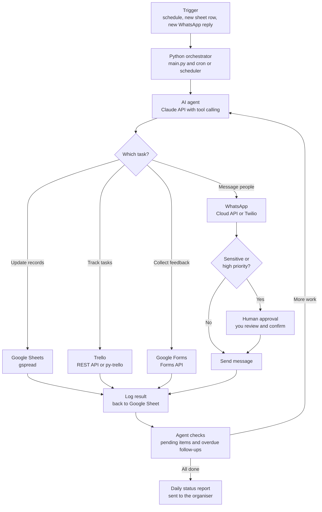

# Agentic AI + Python Automation Flow

```mermaid
flowchart TD
    A["Trigger<br/>schedule, new sheet row, new WhatsApp reply"] --> B["Python orchestrator<br/>main.py and cron or scheduler"]
    B --> C["AI agent<br/>Claude API with tool calling"]
    C --> D{"Which task?"}

    D -->|"Update records"| E["Google Sheets<br/>gspread"]
    D -->|"Track tasks"| F["Trello<br/>REST API or py-trello"]
    D -->|"Collect feedback"| G["Google Forms<br/>Forms API"]
    D -->|"Message people"| H["WhatsApp<br/>Cloud API or Twilio"]

    H --> I{"Sensitive or<br/>high priority?"}
    I -->|"Yes"| J["Human approval<br/>you review and confirm"]
    I -->|"No"| K["Send message"]
    J --> K

    E --> L["Log result<br/>back to Google Sheet"]
    F --> L
    G --> L
    K --> L

    L --> M["Agent checks<br/>pending items and overdue follow-ups"]
    M -->|"More work"| C
    M -->|"All done"| N["Daily status report<br/>sent to the organiser"]
```
